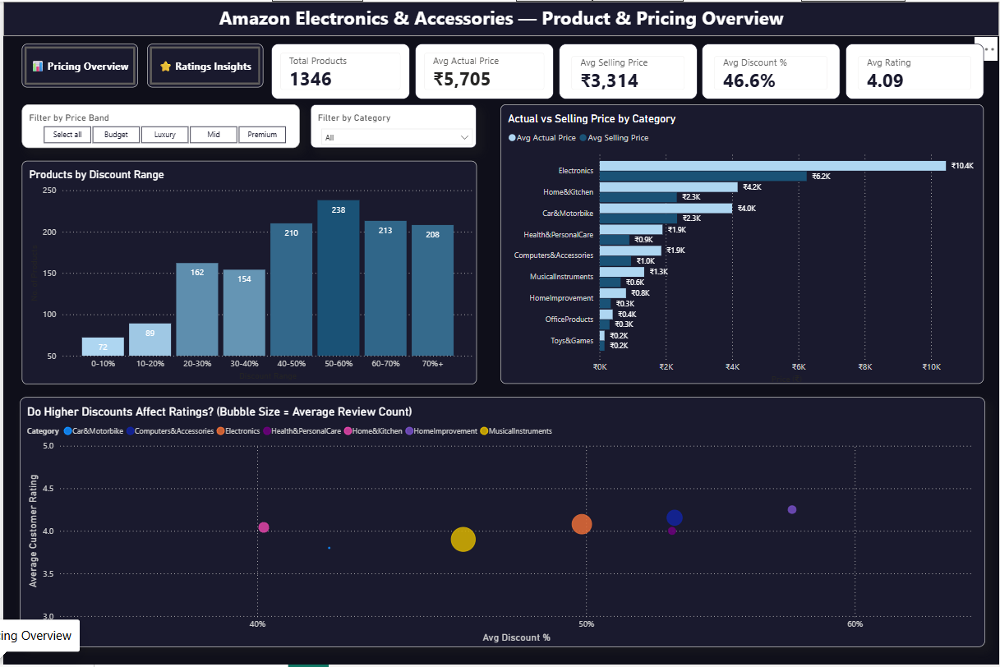
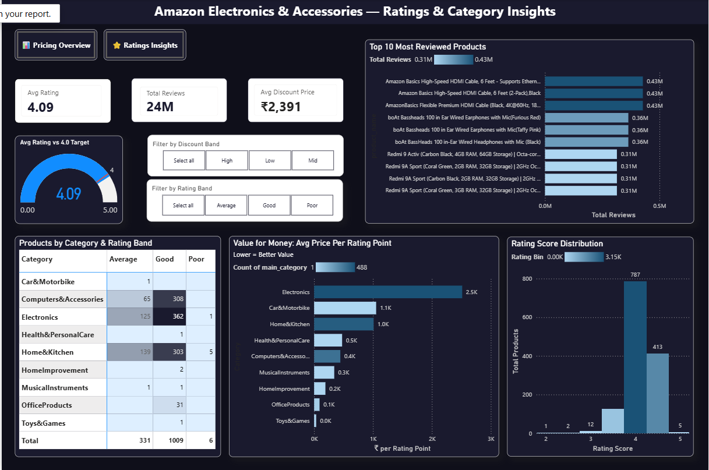

# 🛒 Amazon Electronics & Accessories — Sales Analysis

> End-to-end analysis of 1,346 Amazon product listings across 10 categories,
> covering pricing strategy, discount behaviour, and customer satisfaction.
> Built in **Microsoft Excel** (cleaning & modelling) and **Power BI** (interactive dashboards).

---

## 📌 Project Overview

This project answers 7 core business questions about how Amazon sellers price,
discount, and earn customer trust across Electronics and Accessories categories in India.

The raw Kaggle dataset was cleaned in Excel, enriched with calculated columns,
and then visualised in a two-page Power BI report with interactive filters.

---

## 📊 Dashboard Preview

### Page 1 — Pricing Overview


Key visuals:
- **KPI strip** — 1,346 products · Avg actual price ₹5,705 · Avg selling price ₹3,314 · Avg discount 46.6% · Avg rating 4.09
- **Products by Discount Range** — most products cluster in the 40–60% discount band (238 at 50–60%)
- **Actual vs Selling Price by Category** — Electronics shows the largest absolute price gap (₹10.4K → ₹6.2K)
- **Do Higher Discounts Affect Ratings? (Bubble chart)** — bubble size = avg review count; Electronics has the highest review volume despite mid-range ratings
- Filters: Price Band (Budget / Mid / Luxury / Premium) · Category

### Page 2 — Ratings & Category Insights


Key visuals:
- **Gauge** — avg rating 4.09 vs a 4.0 target
- **Top 10 Most Reviewed Products** — Amazon Basics HDMI cables dominate with ~0.43M reviews each; boAt earphones follow at ~0.36M
- **Products by Category & Rating Band** — Electronics leads with 362 "Good"-rated products; Home&Kitchen has 5 "Poor"-rated
- **Value for Money: Avg Price Per Rating Point** — Electronics costs ₹2.5K per rating point vs Toys&Games at near zero
- **Rating Score Distribution** — 787 products rated 4, 413 rated 5; very few rated below 3
- Filters: Discount Band (High / Mid / Low) · Rating Band (Good / Average / Poor)

---

## ❓ Business Questions Answered

| # | Question | Short Answer |
|---|----------|-------------|
| 1 | Does higher discount = higher rating? | No — ratings *fall* as discounts rise |
| 2 | Which categories are over-discounted but under-rated? | Car&Motorbike (42% avg discount, 3.8 rating) |
| 3 | Which categories drive the most engagement? | Electronics (59% of all reviews) |
| 4 | Which category has the best price-to-rating ratio? | Toys&Games (₹34.9 per rating point) |
| 5 | Do more expensive products get rated higher? | Barely — Luxury scores only 0.09 pts above Budget |
| 6 | What discount range maximises customer rating? | 0–10% (avg rating 4.21); rating drops to 4.02 at 70%+ |
| 7 | Which category has the highest rating consistency? | OfficeProducts (rating 4.31, SD 0.15) |

---

## 💡 Key Findings

1. **Discounting more does not earn trust.**
   Products with <20% discount average a 4.16 rating vs 4.06 for heavily discounted ones.

2. **Car&Motorbike is the most over-discounted, under-rated category.**
   42% average discount, yet the lowest rating at 3.8.

3. **Electronics has massive reach but unmet expectations.**
   It drives 59% of all reviews but sits mid-table on customer rating.

4. **Toys&Games delivers the best value for money.**
   At ₹34.9 per rating point vs Electronics' ₹2,513 — highest cost, average satisfaction.

5. **Price barely predicts rating.**
   Luxury products score only 0.09 pts higher than Budget products.

6. **Sweet spot for discounting is under 20%.**
   Rating peaks at 4.21 (0–10% discount) and declines steadily above that.

7. **OfficeProducts wins on quality AND consistency.**
   Highest rating (4.31) with the lowest standard deviation (0.15).

---

## 📁 Repository Structure

```
E-commerce-Sales-Analysis/
│
├── data/
│   ├── amazon_raw.csv            # Original Kaggle dataset (unmodified)
│   └── amazon_cleaned.xlsx       # Cleaned dataset with calculated columns
│
├── dashboard/
│   └── amazon_analysis.pbix      # Power BI report (2-page interactive dashboard)
│
├── assets/
│   ├── dashboard_pricing.png     # Pricing Overview screenshot
│   └── dashboard_ratings.png     # Ratings & Category Insights screenshot
│
└── README.md
```

---

## 🗂️ Dataset

| Field | Detail |
|-------|--------|
| Source | [Amazon Sales Dataset — Kaggle (karkavelraja)](https://www.kaggle.com/datasets/karkavelrajaa/amazon-sales-dataset) |
| Products | 1,346 |
| Categories | 10 |
| Total Reviews Analysed | 24M+ |
| Price Range | ₹39 – ₹1,39,900 |

**Calculated columns added during cleaning:**
- `discount_pct` — derived from actual vs selling price
- `discount_band` — High / Mid / Low buckets
- `price_band` — Budget / Mid / Luxury / Premium
- `rating_band` — Good (≥4.2) / Average (3.5–4.2) / Poor (<3.5)
- `price_per_rating_point` — selling price ÷ rating

---

## 🛠️ Tools Used

| Tool | Purpose |
|------|---------|
| Microsoft Excel | Data cleaning, null handling, calculated columns, pivot validation |
| Power BI Desktop | Interactive 2-page dashboard with cross-filtering and slicers |

---

## 🚀 How to Use

1. Clone or download this repository.
2. Open `data/amazon_cleaned.xlsx` to explore the cleaned dataset.
3. Open `dashboard/amazon_analysis.pbix` in **Power BI Desktop** (free).
4. Use the **Price Band** and **Category** slicers on Page 1 to filter all visuals.
5. Switch to Page 2 (Ratings Insights) and filter by **Discount Band** or **Rating Band**.

---

## 👤 Author

**Aksh** · [GitHub](https://github.com/akshp5109)

---

*Dataset sourced from Kaggle under public licence. All analysis and visualisations are original work.*
